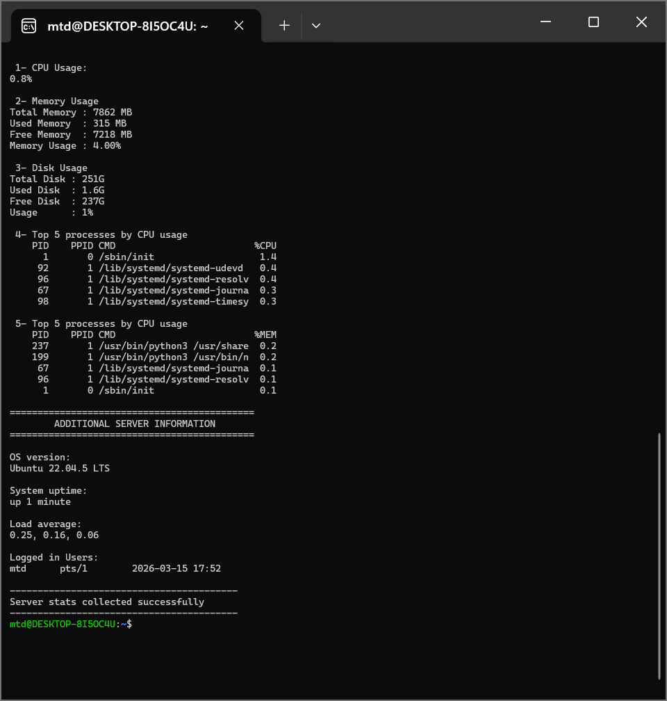

# survival.sh 🖥️

> Script Bash de surveillance des statistiques vitales d'un serveur Linux, conçu pour fonctionner sans interface graphique.


---

## 📌 Contexte

En administration système, il arrive que l'interface graphique tombe ou soit indisponible — panne, crash du serveur d'affichage, connexion SSH uniquement. Dans ces situations, il faut pouvoir diagnostiquer rapidement l'état du serveur en ligne de commande.

`survival.sh` répond à ce besoin : un seul script, zéro dépendance, résultat immédiat.

---

## ⚡ Ce que le script affiche

| Section | Informations |
|---|---|
| **CPU Usage** | Pourcentage d'utilisation processeur |
| **Memory Usage** | RAM totale, utilisée, libre et % d'usage |
| **Disk Usage** | Espace disque total, utilisé, libre et % |
| **Top 5 CPU** | Les 5 processus les plus gourmands en CPU |
| **Top 5 MEM** | Les 5 processus les plus gourmands en RAM |
| **OS Version** | Distribution Linux et version |
| **System Uptime** | Temps de fonctionnement depuis le dernier démarrage |
| **Load Average** | Charge système sur 1, 5 et 15 minutes |
| **Logged in Users** | Sessions actives sur le serveur |

---

## 🚀 Utilisation

**1. Cloner le repo**
```bash
git clone https://github.com/TONGITHUB/survival.sh.git
cd survival.sh
```

**2. Rendre le script exécutable**
```bash
chmod +x survival.sh
```

**3. Lancer**
```bash
bash survival.sh
```

---

## 📸 Aperçu



---

## 🛠️ Compatibilité

| OS | Statut |
|---|---|
| Ubuntu 22.04 LTS | ✅ Testé |
| Ubuntu 20.04 LTS | ✅ Compatible |
| Debian | ✅ Compatible |
| Autres distros Linux | ⚠️ Non testé |

---

## 📚 Ce que j'ai appris

- Utilisation des commandes système Linux : `top`, `df`, `free`, `uptime`, `who`
- Manipulation de variables et formatage de l'affichage en Bash
- Lecture et parsing de la sortie de commandes système
- Gestion d'un script opérationnel en environnement sans GUI

---

## 👤 Auteur

**Mor Tala Dieng** — Étudiant en Systèmes, Réseaux et Télécoms (SRT)  
Université Alioune Diop de Bambey (UADB), Sénégal  
🔗 [LinkedIn](https://www.linkedin.com/in/mor-tala-dieng-676667344?utm_source=share&utm_campaign=share_via&utm_content=profile&utm_medium=android_app) · [Portfolio](https://m-t-dieng.github.io/portfolio-MT-sec/)
